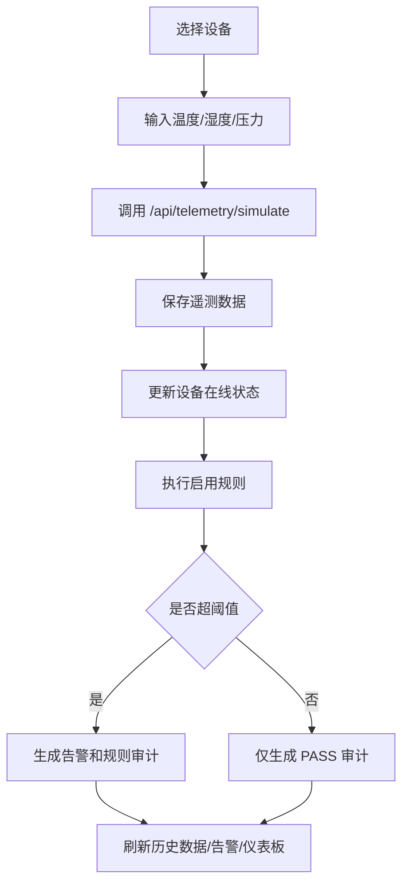

# 工业互联网平台设计报告

## 1. 平台定位

本平台面向工业现场设备接入、运行监控和告警处置场景，参考 PandaX 物联网平台功能，建设一个工业互联网平台原型。平台既包含真实可运行的核心业务闭环，也包含服务管理、组态大屏、视频中心等扩展能力的当前版本实现。

平台设计重点为：

- 以设备为中心组织产品、分组、数据和告警。
- 以规则引擎实现数据驱动的告警生成。
- 以仪表板和数据中心支撑运行监控。
- 以任务、日志和系统设置支撑运维管理。

## 2. 页面与导航设计

前端采用后台管理平台布局，包括登录页、左侧菜单、顶部栏、面包屑和内容区。导航覆盖以下模块：

| 一级模块 | 二级功能 |
| --- | --- |
| 控制台 | 仪表板、统计图表、服务监控入口 |
| 设备管理 | 产品分类、产品管理、设备分组、设备管理、设备地图、模拟上报 |
| 服务管理 | 网络服务、解析脚本 |
| 规则引擎 | 规则配置、规则审计 |
| 组态大屏 | 大屏分组、组态大屏、可视化预览 |
| 视频中心 | 视频设备台账、流代理配置、视频广场通道状态、视频告警任务 |
| 数据中心 | 历史数据、历史告警、服务监控 |
| 任务中心 | 定时任务、任务日志 |
| 系统设置 | 用户、角色、固件、操作日志、登录日志 |

## 3. 登录模块设计

### 3.1 页面设计

登录页提供账号、密码输入框和默认账号提示。用户输入 `admin / 123456` 后调用登录接口。

### 3.2 业务流程

1. 前端提交用户名和密码。
2. 后端查询用户并校验密码。
3. 校验成功后返回 Token、用户名、真实姓名和角色。
4. 前端保存 Token 到 `localStorage`。
5. 后续请求自动携带 `Authorization` 请求头。

### 3.3 设计说明

当前版本采用简化 Token，便于本地业务验证。生产系统可升级为 JWT、刷新 Token 和权限菜单。

## 4. 仪表板模块设计

### 4.1 功能设计

仪表板用于集中展示平台运行状态，包括：

- 产品数量、分组数量、设备数量。
- 在线设备数量。
- 告警总数和未处理告警数量。
- 今日遥测数量。
- 任务数量。
- 设备状态分布、告警等级分布、近期遥测和近期告警。

### 4.2 接口设计

- `GET /api/dashboard/summary`：统计卡片。
- `GET /api/dashboard/charts`：图表数据。
- `GET /api/dashboard/monitor`：服务监控数据。

### 4.3 展示设计

前端使用 Element Plus 卡片和 ECharts 图表展示统计结果。仪表板数据来源于数据库实时统计，因此设备上报和告警处置后，刷新仪表板可以看到数据变化。

## 5. 设备管理模块设计

### 5.1 产品分类

产品分类用于按业务类型划分设备产品，例如工业传感器、边缘网关等。支持新增、编辑、删除、查询和状态切换。

### 5.2 产品管理

产品表示一类设备模型，包含名称、编码、分类、协议和厂商。示例产品包括 PandaX 温湿度采集器和 PandaX 边缘网关。

### 5.3 设备分组

设备分组用于按车间、区域或站点组织设备，例如一号车间、能源站。

### 5.4 设备管理

设备台账记录设备名称、编码、设备 Key、所属产品、所属分组、状态、位置和经纬度。平台提供模拟上报按钮，用于验证设备数据接入链路。

### 5.5 模拟上报流程



## 6. 服务管理模块设计

服务管理参考 PandaX 的网络组件和脚本能力，主要用于维护设备接入服务和数据解析配置。

### 6.1 网络服务

字段包括服务类型、主机、端口、上行消息数、下行消息数和运行状态。支持启动、停止和状态展示。

### 6.2 解析脚本

解析脚本用于描述如何把设备原始 payload 转换为平台遥测指标。示例脚本为 JavaScript：

```javascript
return {temperature: payload.temp, humidity: payload.hum};
```

当前版本中脚本作为配置展示，不执行真实沙箱解析。

## 7. 规则引擎模块设计

### 7.1 规则配置

规则字段包括：

- 指标：temperature、humidity、pressure。
- 运算符：`>`、`>=`、`<`、`<=`、`==`。
- 阈值：如 80。
- 启用状态：enabled。
- 告警等级：HIGH、MEDIUM、LOW。

### 7.2 规则执行

设备模拟上报后，后端查询 `enabled=true` 的规则，按指标和阈值判断是否命中。每次执行都会写入 `rule_audit`。命中时写入 `alarm`。

### 7.3 规则启停

规则启停接口会同步修改 `status` 和 `enabled`。规则关闭后，同样的高温数据不会再触发告警。

## 8. 数据中心模块设计

### 8.1 历史数据

历史数据页面展示最近遥测记录，包括设备、温度、湿度、压力、payload 和上报时间。

### 8.2 历史告警

历史告警页面展示告警名称、设备、等级、类型、内容、状态、处理人和处理时间。用户可以处置 OPEN 告警。

### 8.3 告警处置

处置后告警状态改为 CLOSED，保存处理人和说明，并写入操作日志。

## 9. 组态大屏模块设计

组态大屏用于展示工厂运行总览、设备状态和告警趋势。当前版本中支持大屏列表、分组、配置 JSON、发布状态和预览页面。示例大屏为“PandaX 工厂运行总览”。

## 10. 视频中心模块设计

视频中心提供视频设备台账、流代理配置、视频广场通道状态和视频告警任务。当前版本不声明完整生产级流媒体能力；真实流媒体播放、GB28181 级联和录像回放可作为后续演进。

| 子模块 | 设计说明 |
| --- | --- |
| 视频设备 | 管理摄像头名称、通道号、流地址和位置 |
| 拉流代理 | 管理播放地址、协议和设备关联 |
| 视频广场 | 支持 1/4/9 分屏布局和通道状态展示 |
| 视频告警任务 | 记录算法名称、关联设备和启用状态 |

## 11. 任务中心模块设计

任务中心用于管理定时任务。任务字段包括名称、编码、Cron 表达式、运行状态和最近执行结果。启动或停止任务时，后端会更新任务状态并写入任务日志。

## 12. 系统设置模块设计

系统设置包括用户、角色、固件、操作日志和登录日志。

- 用户管理：维护账号、密码、真实姓名和角色。
- 角色管理：维护角色名称和权限字符串。
- 固件管理：维护版本、目标产品、升级状态和文件地址。
- 操作日志：记录登录、模拟上报、告警处置等操作。
- 登录日志：记录用户名、IP 和登录结果。

## 13. 设计总结

平台通过模块化页面和 REST API 形成完整工业互联网平台原型。其中设备上报、规则告警、历史数据、告警处置和日志审计为真实业务闭环；服务管理、组态大屏、视频中心等能力在当前版本提供台账、配置、状态和发布等功能，并为后续生产化扩展保留边界。
