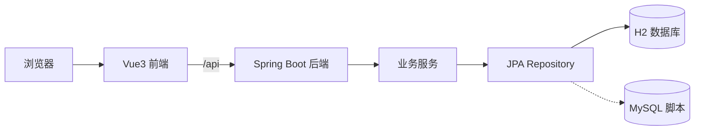

# 工业互联网平台开发实践项目报告

## 摘要

本项目根据《工业互联网平台开发实践》实践指导书，并参考 PandaX 物联网平台功能说明，设计并实现了一个工业互联网平台课程实践原型。系统采用 Spring Boot 3 + Vue3 前后端分离架构，默认使用 H2 文件数据库运行，同时提供 MySQL 建表和示例数据脚本。平台覆盖控制台、设备管理、服务管理、规则引擎、组态大屏、视频中心、数据中心、任务中心和系统设置等模块，重点实现“设备接入—数据上报—规则告警—历史查询—告警处置—日志审计”的核心闭环。

关键词：工业互联网；物联网平台；Spring Boot；Vue3；规则引擎；告警处置

## 1. 项目背景

工业互联网平台是连接工业设备、业务系统和管理人员的重要基础设施。通过平台可以实现设备建模、数据采集、规则分析、告警处置、可视化监控和运维管理。PandaX 物联网平台功能说明展示了较完整的平台能力，包括设备管理、服务管理、规则引擎、视频中心、数据中心和系统设置等内容。

课程实践要求完成工业互联网平台开发，并提交代码和相关文档。因此，本项目在控制开发范围的基础上，选择关键业务闭环进行真实实现，对复杂扩展模块进行演示化实现，最终形成可运行、可演示、可说明的综合平台原型。

## 2. 需求分析

### 2.1 功能需求

系统应具备以下功能：

- 用户登录与接口鉴权。
- 仪表板统计和图表展示。
- 产品分类、产品、设备分组、设备管理。
- 设备模拟遥测上报。
- 阈值规则配置、规则启停和规则审计。
- 超阈值自动生成告警。
- 历史遥测数据和历史告警查询。
- 告警处置和操作日志。
- 任务管理、任务启停和任务日志。
- 网络服务、解析脚本、组态大屏、视频中心、固件和系统日志等演示模块。

### 2.2 非功能需求

- 本地可运行，启动步骤简单。
- 默认数据库不依赖外部服务。
- 前后端结构清晰，便于查看和扩展。
- 核心链路必须真实写入数据库并产生联动效果。
- 文档完整，能够支撑课程验收和答辩。

## 3. 总体设计

系统采用前后端分离结构：

- 后端：Spring Boot 3、Spring Web、Spring Data JPA、H2、MySQL Connector。
- 前端：Vue3、Vite、Element Plus、ECharts、Axios。
- 数据库：H2 文件数据库默认运行，MySQL 脚本交付。



## 4. 详细设计与实现

### 4.1 后端实现

后端主要文件包括：

- `Controllers.java`：定义登录、仪表板、遥测、告警、任务以及各类 CRUD 接口。
- `PlatformService.java`：实现登录、模拟上报、规则执行、告警处置、任务启停和日志记录。
- `Entities.java`：定义用户、角色、产品、设备、遥测、规则、告警等实体。
- `Repositories.java`：定义 JPA Repository。
- `DataInitializer.java`：初始化示例数据。
- `SecurityConfig.java`：实现简化 Token 拦截。

### 4.2 前端实现

前端实现登录页、主布局、菜单、仪表板、通用资源页面、规则页面、任务页面、视频页面和大屏页面。通过 Axios 调用后端接口，并对后端字段进行页面适配。

### 4.3 数据库实现

数据库表覆盖用户、角色、产品分类、产品、设备分组、设备、遥测、规则、规则审计、告警、网络服务、解析脚本、组态大屏、视频、任务、固件和日志等对象。默认由 JPA 自动维护 H2 表结构，同时提供 MySQL 建表和示例数据脚本。

## 5. 核心业务闭环

核心演示流程如下：

1. 使用 `admin / 123456` 登录。
2. 进入设备管理查看示例设备。
3. 对设备执行模拟上报，输入温度、湿度、压力。
4. 后端保存遥测数据并更新设备在线状态。
5. 后端查询启用规则并执行阈值判断。
6. 温度超过 80℃ 时生成规则审计和告警。
7. 在历史数据页面查看遥测记录。
8. 在历史告警页面查看并处置告警。
9. 在仪表板查看统计变化。
10. 在操作日志和登录日志页面查看审计信息。

该闭环证明系统不是纯静态页面，而是具备真实数据流和业务联动。

## 6. 测试与验证

已完成以下验证：

| 验证项 | 结果 |
| --- | --- |
| 后端 Maven 构建 | 通过 |
| 前端 Vite 构建 | 通过 |
| 登录接口 | 通过 |
| 仪表板统计接口 | 通过 |
| 设备模拟上报 | 通过 |
| 高温触发告警 | 通过 |
| 规则关闭后不触发告警 | 通过 |
| 告警处置 | 通过 |
| 任务启动接口 | 通过 |
| 提交目录清理 | 通过 |

构建命令：

```bash
cd backend
mvn -q -DskipTests package

cd frontend
npm install
npm run build
```

前端构建存在非阻断提示：npm audit 提示 1 个 moderate vulnerability，Vite 提示部分 chunk 超过 500kB，主要由 Element Plus 和 ECharts 引起，不影响课程演示。

## 7. 运行部署

### 7.1 后端启动

```bash
cd backend
mvn spring-boot:run
```

后端地址：`http://localhost:8080`。

### 7.2 前端启动

```bash
cd frontend
npm install
npm run dev
```

前端地址：`http://localhost:5173`。

### 7.3 默认账号

```text
账号：admin
密码：123456
```

## 8. 项目特色

- 核心业务闭环真实实现，数据可写入、可查询、可联动。
- 默认 H2 数据库降低运行门槛，同时提供 MySQL 脚本。
- 前端模块覆盖广，能够展示综合工业互联网平台形态。
- 规则启停语义经过验证，关闭规则后不会继续触发告警。
- 文档、API、数据库和测试用例完整，便于课程验收。

## 9. 存在问题与改进方向

| 问题 | 改进方向 |
| --- | --- |
| 设备接入为模拟上报 | 接入真实 MQTT Broker 和设备 SDK |
| 鉴权为简化 Token | 升级为 JWT、RBAC 和权限注解 |
| 视频中心为演示页面 | 接入 GB28181、WebRTC、FLV 或 HLS 流 |
| 组态大屏为轻量配置 | 增加拖拽编辑器和组件库 |
| 前端构建包较大 | 路由懒加载、组件按需加载和手动分包 |
| 自动化测试较少 | 增加单元测试、接口测试和端到端测试 |

## 10. 总结

本项目完成了工业互联网平台课程实践的主要目标。系统采用主流前后端分离技术栈，具备清晰的项目结构和运行说明；实现了设备管理、模拟上报、规则告警、历史数据、告警处置和日志审计等核心功能；同时覆盖服务管理、组态大屏、视频中心、任务中心和系统设置等平台模块。项目能够支撑课程演示和答辩，并为后续接入真实设备、完善权限和扩展平台能力提供基础。
